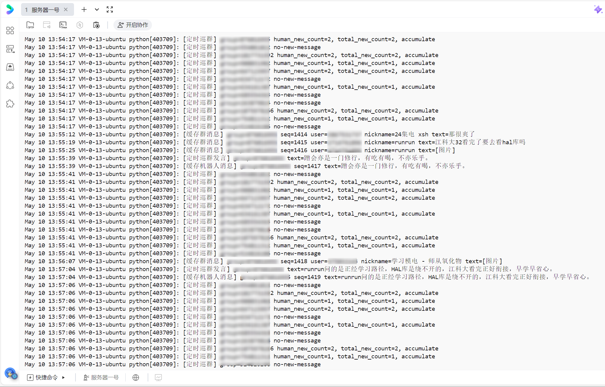
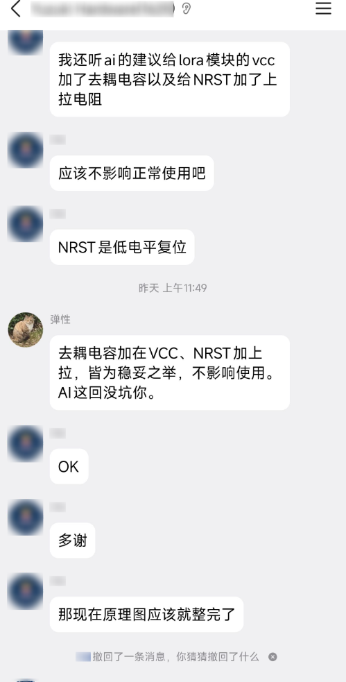
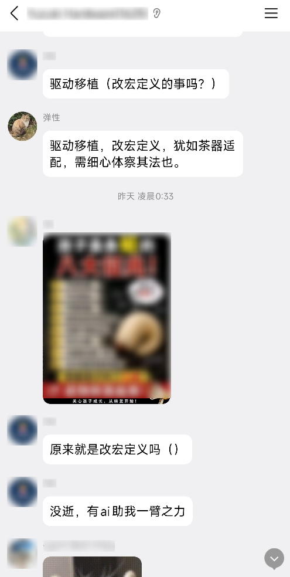
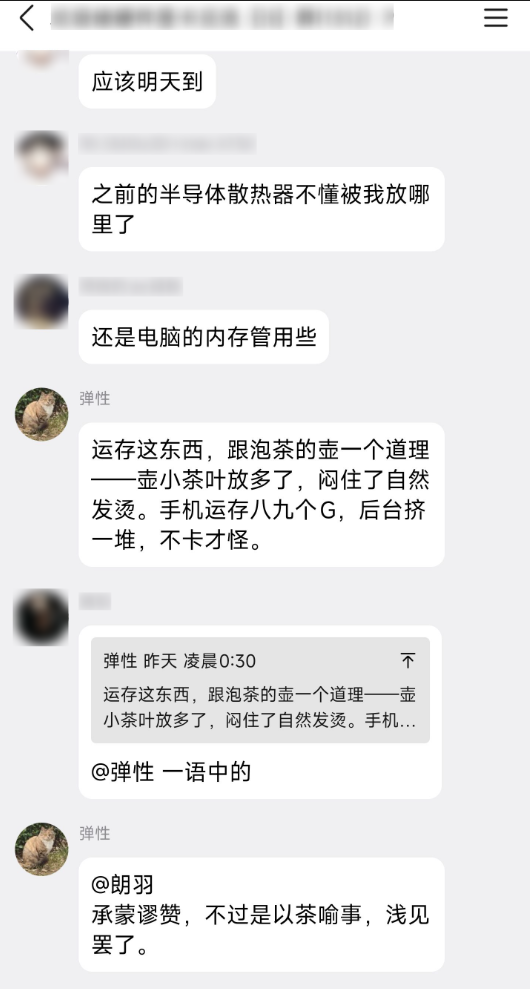
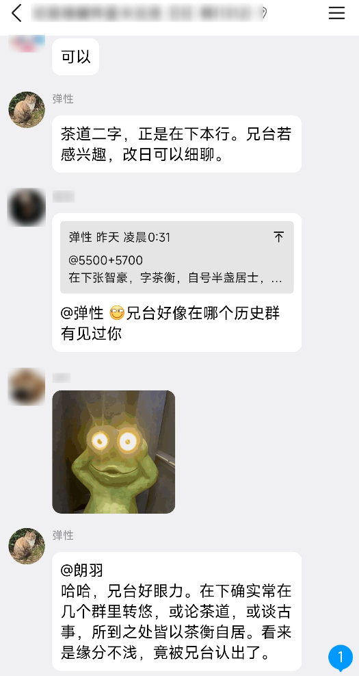

# Agent QQ Sandbox Bot

一个基于 **OpenClaw + NapCat OneBot + Python WebSocket** 的 QQ 群 AI 机器人桥接项目。

本项目可以把一个 QQ 账号接入群聊，使其具备群内 @ 回复、关键词触发、私聊回复、定时巡群、任务模式、发图、发文件、群消息缓存、机器人自身发言记忆等能力。项目适合用于学习 AI Agent 接入、OneBot 协议、WebSocket 消息处理、Linux 服务部署、systemd 守护进程、Docker 容器路径挂载和服务日志排查。

---

## 1. 项目背景

本项目最初用于将 OpenClaw 的大模型能力接入 QQ 群，使机器人能够像普通群成员一样参与对话。

机器人设定为“弹性 / 张智豪”，可以通过 BOOTSTRAP.md 维护长期人格设定。项目部署在 Ubuntu Server 上，NapCat 负责 QQ 登录和 OneBot 协议事件上报，Python 桥接脚本负责接收 QQ 消息、判断触发条件、调用 OpenClaw Gateway，再把模型回复发送回 QQ 群。

---

## 2. 功能特性

### 基础对话能力

- 支持 QQ 群内 @ 机器人后自动回复
- 支持关键词触发，例如“弹性”“张智豪”“茶”
- 支持私聊回复
- 支持读取 OpenClaw workspace 中的 `BOOTSTRAP.md` 作为人格设定
- 支持通过 OpenClaw Gateway 调用大模型

### 群聊增强能力

- 支持定时巡群
- 支持主动判断某个群是否值得插话
- 支持群消息缓存
- 支持机器人自身发言写入缓存，避免重复说相似内容
- 支持过滤无效回复，例如 `SILENCE`、OpenClaw 后台提示、初始化废话等
- 支持避免机器人自己触发自己

### 文件与图片能力

- 支持发送群图片
- 支持上传群文件
- 支持通过宿主机目录和 NapCat 容器目录挂载共享文件

### 运维能力

- 支持 systemd 后台运行
- 支持服务异常后自动重启
- 支持日志排查
- 支持 WebSocket 断线重连
- 支持 OpenClaw HTTP API 调用异常处理

---

## 3. 总体架构

```text
QQ 群 / QQ 私聊
      |
      v
NapCat OneBot
      |
      | WebSocket 事件上报
      | ws://127.0.0.1:3001
      v
qq_openclaw_bridge.py
      |
      | 判断消息类型
      | - @ 触发
      | - 关键词触发
      | - 私聊触发
      | - 任务模式
      | - 发图/发文件命令
      | - 定时巡群
      v
OpenClaw Gateway
      |
      | HTTP API
      | http://127.0.0.1:29306/v1/chat/completions
      v
大模型回复
      |
      v
通过 OneBot API 发回 QQ 群 / 私聊
```

---

## 4. 核心文件说明

```text
agent-qq-sandbox-bot/
├── qq_openclaw_bridge.py       # 主程序，负责 QQ 消息桥接和 OpenClaw 调用
├── README.md                   # 项目说明文档
├── requirements.txt            # Python 依赖
├── .gitignore                  # Git 忽略规则，避免上传敏感信息
├── share/                      # 宿主机与 NapCat 容器共享目录
└── screenshots/ 或 docs/images/ # README 演示截图目录，可选
```

---

## 5. 主程序模块逻辑

主程序是 `qq_openclaw_bridge.py`，整体可以分成以下几个逻辑模块。

### 5.1 配置模块

负责定义 OneBot、OpenClaw、缓存、触发词、任务模式等配置。

典型配置包括：

```python
ONEBOT_WS = "ws://127.0.0.1:3001"
OPENCLAW_URL = "http://127.0.0.1:29306/v1/chat/completions"
TRIGGER_WORDS = ["弹性", "张智豪", "茶"]
```

管理员 QQ 号不建议直接写死在代码里，推荐通过环境变量传入：

```bash
ADMIN_QQ_IDS=123456789
```

OpenClaw Gateway token 也推荐通过环境变量传入：

```bash
OPENCLAW_GATEWAY_TOKEN=your_token_here
```

如果没有设置环境变量，脚本也可以从本机 OpenClaw 配置中读取 Gateway token。

---

### 5.2 人格设定模块

机器人会尝试读取：

```text
/root/.openclaw/workspace/BOOTSTRAP.md
```

这个文件用于保存“弹性 / 张智豪”的人格设定，例如：

- 名字
- 身份
- 说话风格
- 禁止提及后台初始化
- 群聊发言风格
- 文言/半文言语气

如果 `BOOTSTRAP.md` 不存在，脚本会使用兜底人格提示词，避免机器人在群里说自己没有身份。

---

### 5.3 OpenClaw 调用模块

该模块负责把消息转换为 OpenAI-compatible Chat Completions 请求，然后调用 OpenClaw Gateway。

调用路径通常是：

```text
POST http://127.0.0.1:29306/v1/chat/completions
```

请求会包含：

- system prompt
- 群聊上下文
- 用户当前消息
- 历史对话
- max_tokens
- stream 参数

常见异常：

```text
401 Unauthorized：OpenClaw Gateway token 不正确或未传
404 Not Found：OpenClaw Gateway 接口路径或 endpoint 配置错误
No response：OpenClaw 没有返回有效内容
```

---

### 5.4 QQ 消息解析模块

NapCat 通过 OneBot WebSocket 上报 QQ 事件，脚本会解析消息内容。

它需要处理多种消息类型：

```text
text    文本消息
at      @消息
image   图片消息
face    表情消息
reply   引用回复
```

解析后统一转换成文本，方便后续判断是否触发机器人。

---

### 5.5 触发逻辑模块

群聊中主要有三种触发方式。

#### 1. @ 触发

群成员 @ 机器人时，机器人会回复，并且回复时也会 @ 对方。

示例：

```text
@弹性 你是谁
```

机器人回复时会带上对用户的 @。

#### 2. 关键词触发

当群消息中出现关键词时，也可以触发机器人。

默认关键词：

```text
弹性
张智豪
茶
```

示例：

```text
弹性出来
张智豪何在
这茶不错
```

关键词触发时，机器人不会 @ 对方，避免打扰群友。

#### 3. 私聊触发

私聊机器人时，默认会直接回复。

---

### 5.6 主动触发上下文模块

普通 @ 和关键词触发时，机器人不仅会看当前这句话，还会额外读取当前群最近的缓存消息。

这样可以做到：

- 回答时结合群聊上下文
- 不重复自己刚刚说过的话
- 理解别人引用的前文
- 更像真实群友，而不是每次都孤立回答

典型逻辑：

```text
当前触发消息
      +
该群最近若干条缓存
      +
普通对话历史
      +
人格设定
      =
OpenClaw 回复
```

---

### 5.7 群消息缓存模块

脚本会为每个群维护一个消息缓存。

缓存内容包括：

```text
消息序号 seq
时间 time
用户 user_id
昵称 nickname
文本 text
是否为机器人自己 is_bot
```

缓存的作用：

- 给主动回复提供上下文
- 给定时巡群提供判断依据
- 让机器人知道自己刚才说过什么
- 避免重复发言
- 支持后续扩展长期记忆

缓存通常使用 `deque(maxlen=...)`，新消息超过上限后，会自动挤掉最旧消息，避免无限占用内存。

---

### 5.8 机器人自身发言缓存模块

机器人自己发出去的话也会写入群缓存。

这一步很重要，因为如果不记录机器人自己的发言，下一轮巡群或主动回复时，模型可能不知道自己刚刚说过什么，从而产生重复回复。

示例缓存日志：

```text
[缓存机器人消息] group=xxx seq=123 text=...
```

---

### 5.9 定时巡群模块

定时巡群是本项目的核心功能之一。

它会按照固定间隔检查所有有缓存的群，判断是否要主动说话。

典型流程：

```text
每隔 N 秒
  |
  v
遍历已缓存的群
  |
  v
读取上次巡群后新增消息
  |
  v
判断群友新增消息数量
  |
  v
不足阈值：继续累计
达到阈值：交给 OpenClaw 判断
  |
  v
OpenClaw 返回 SILENCE：不发言
OpenClaw 返回正常内容：发到群里
```

典型日志：

```text
[定时巡群] group=xxx no-new-message
[定时巡群] group=xxx human_new_count=1, total_new_count=1, accumulate
[定时巡群] group=xxx silence
[定时巡群发言] group=xxx text=...
```

字段含义：

```text
human_new_count：新增的群友消息数量
total_new_count：新增总消息数量，包括机器人自身消息
accumulate：消息数量不够，继续累计
no-new-message：没有新增消息
silence：模型判断不适合插话
定时巡群发言：机器人主动接话
```

机器人自身消息只作为上下文，不参与凑触发门槛，避免机器人自己触发自己。

---

### 5.10 SILENCE 与 bad-answer 机制

定时巡群时，模型不一定每次都应该说话。

如果模型判断不该插话，就应该输出：

```text
SILENCE
```

脚本检测到 `SILENCE` 后不会发群。

`bad-answer` 表示模型返回了不适合发到群里的内容，例如：

```text
BOOTSTRAP.md is missing
OpenClaw 初始化提示
No response from OpenClaw
workspace 相关后台提示
```

这些内容会被脚本拦截，不会发到 QQ 群里。

---

### 5.11 任务模式模块

任务模式用于执行复杂、多步骤任务。

示例：

```text
弹性任务：帮我分三步分析这个方案。
```

或者：

```text
@弹性 任务：帮我写一个群公告，先列思路，再写初稿，再润色。
```

任务模式通常会多轮调用 OpenClaw，直到模型输出完成标记，或达到最大执行轮数。

任务模式建议只允许管理员触发，避免群友滥用消耗 token。

---

### 5.12 发图模块

项目支持从服务器共享目录发送图片到 QQ 群。

图片应放到：

```text
/root/openclaw-qq/share/
```

群内命令：

```text
弹性发图：test.png
```

或者：

```text
@弹性 发图：test.png
```

注意：NapCat 容器内看到的路径通常不是宿主机路径，而是挂载后的容器路径。例如：

```text
宿主机路径：/root/openclaw-qq/share/test.png
容器内路径：/share/test.png
```

如果路径写错，可能出现：

```text
rich media transfer failed
```

---

### 5.13 上传群文件模块

文件同样放到：

```text
/root/openclaw-qq/share/
```

群内命令：

```text
弹性发文件：report.docx
```

上传成功后，机器人会调用 OneBot 的群文件上传接口，把文件发送到群文件中。

---

## 6. 运行环境

推荐环境：

```text
Ubuntu Server 22.04 LTS
Python 3.10+
Docker / Docker Compose
NapCat OneBot
OpenClaw Gateway
```

Python 依赖：

```text
httpx
websockets
```

安装依赖：

```bash
cd /root/openclaw-qq

python3 -m venv venv
source venv/bin/activate

pip install -r requirements.txt
```

如果创建 venv 报错，需要安装：

```bash
apt install -y python3-venv python3-full
```

---

## 7. NapCat 配置

NapCat 负责 QQ 登录和 OneBot 协议接入。

常用端口：

```text
3000：OneBot HTTP API
3001：OneBot WebSocket
6099：NapCat WebUI / 登录相关端口
```

桥接脚本默认连接：

```text
ws://127.0.0.1:3001
```

如果你使用 Docker 部署 NapCat，建议挂载共享目录：

```yaml
volumes:
  - ./share:/share
```

这样宿主机的：

```text
/root/openclaw-qq/share/
```

就能映射到容器内：

```text
/share/
```

---

## 8. OpenClaw Gateway 配置

脚本默认调用：

```text
http://127.0.0.1:29306/v1/chat/completions
```

测试 OpenClaw Gateway 是否可用：

```bash
TOKEN=$(python3 - <<'PY'
import json
print(json.load(open("/root/.openclaw/openclaw.json"))["gateway"]["auth"]["token"])
PY
)

curl -i http://127.0.0.1:29306/v1/models \
  -H "Authorization: Bearer $TOKEN"
```

如果返回模型列表，说明 Gateway 可用。

也可以测试聊天接口：

```bash
curl -i http://127.0.0.1:29306/v1/chat/completions \
  -H "Authorization: Bearer $TOKEN" \
  -H "Content-Type: application/json" \
  -d '{
    "model": "openclaw/default",
    "messages": [
      {
        "role": "user",
        "content": "你好，测试一下"
      }
    ],
    "stream": false
  }'
```

---

## 9. 启动项目

前台运行：

```bash
cd /root/openclaw-qq

source venv/bin/activate
python qq_openclaw_bridge.py
```

看到：

```text
连接 NapCat OneBot: ws://127.0.0.1:3001
已连接 NapCat OneBot
```

说明桥接脚本已经连接到 NapCat。

---

## 10. systemd 后台运行

创建 systemd 服务：

```bash
cat > /etc/systemd/system/qq-openclaw-bridge.service <<'EOF'
[Unit]
Description=QQ OpenClaw Bridge
After=network-online.target docker.service
Wants=network-online.target

[Service]
Type=simple
WorkingDirectory=/root/openclaw-qq
ExecStart=/root/openclaw-qq/venv/bin/python /root/openclaw-qq/qq_openclaw_bridge.py
Restart=always
RestartSec=5
Environment=PYTHONUNBUFFERED=1

[Install]
WantedBy=multi-user.target
EOF
```

启动服务：

```bash
systemctl daemon-reload
systemctl enable --now qq-openclaw-bridge
```

查看状态：

```bash
systemctl status qq-openclaw-bridge --no-pager
```

实时日志：

```bash
journalctl -u qq-openclaw-bridge -f --full
```

只看关键日志：

```bash
journalctl -u qq-openclaw-bridge -f --full | grep --line-buffered -E "连接 NapCat|已连接|缓存群消息|缓存机器人消息|收到@|收到关键词|定时巡群|定时巡群发言"
```

---

## 11. 环境变量配置

建议通过 systemd override 配置敏感环境变量。

创建 override：

```bash
mkdir -p /etc/systemd/system/qq-openclaw-bridge.service.d

cat > /etc/systemd/system/qq-openclaw-bridge.service.d/override.conf <<'EOF'
[Service]
Environment=ADMIN_QQ_IDS=YOUR_QQ_ID
Environment=OPENCLAW_GATEWAY_TOKEN=YOUR_OPENCLAW_GATEWAY_TOKEN
EOF

systemctl daemon-reload
systemctl restart qq-openclaw-bridge
```

不要把真实 QQ 号、群号、token 写入公开仓库。

---

## 12. 常见使用命令

### 12.1 @ 回复

```text
@弹性 你是谁
```

### 12.2 关键词触发

```text
弹性出来
张智豪何在
这茶不错
```

### 12.3 任务模式

```text
弹性任务：帮我分三步分析这个方案。
```

### 12.4 发送图片

先把图片放到：

```text
/root/openclaw-qq/share/test.png
```

然后群里发送：

```text
弹性发图：test.png
```

### 12.5 上传群文件

先把文件放到：

```text
/root/openclaw-qq/share/report.docx
```

然后群里发送：

```text
弹性发文件：report.docx
```

---

## 13. 日志说明

常见日志含义如下：

```text
[缓存群消息]
表示脚本收到并缓存了一条群友消息。

[缓存机器人消息]
表示机器人自己发出的消息已经写入缓存。

[收到@]
表示有人 @ 机器人。

[收到关键词]
表示有人发送了关键词触发消息。

[回复]
表示 OpenClaw 返回了回复，脚本准备发回 QQ。

[定时巡群]
表示巡群任务正在检查某个群。

[定时巡群发言]
表示巡群判断后，机器人主动向群里发送了一句话。

[定时巡群失败]
表示调用 OpenClaw 或发送消息时出现异常。

[定时巡群内部错误]
表示某一个群的巡检逻辑出错，但主循环不会因此退出。
```

---

## 14. 常见问题排查

### 14.1 机器人不回消息

检查服务：

```bash
systemctl status qq-openclaw-bridge --no-pager
```

检查日志：

```bash
journalctl -u qq-openclaw-bridge -n 200 --no-pager --full
```

检查 NapCat WebSocket 是否可用：

```bash
ss -lntp | grep 3001
```

---

### 14.2 OpenClaw HTTP 401

通常是 token 没传或 token 不对。

检查：

```bash
grep -n '"auth"' -A10 /root/.openclaw/openclaw.json
```

或者设置环境变量：

```bash
Environment=OPENCLAW_GATEWAY_TOKEN=YOUR_TOKEN
```

---

### 14.3 OpenClaw HTTP 404

通常是 OpenClaw Gateway endpoint 没开启，或者接口路径写错。

需要确认：

```text
/v1/chat/completions
```

已经可用。

---

### 14.4 发图失败 rich media transfer failed

常见原因：

```text
1. 图片路径写成了宿主机路径，而不是容器内路径
2. 图片文件不存在
3. NapCat 没有权限读取图片
4. 图片格式或大小异常
```

建议确认：

```bash
docker exec napcat sh -lc "ls -l /share"
```

---

### 14.5 定时巡群不运行

查看是否有巡群日志：

```bash
journalctl -u qq-openclaw-bridge -n 300 --no-pager --full | grep "定时巡群"
```

如果服务还在收消息但没有巡群日志，可能是巡群 task 异常退出。可以看：

```bash
journalctl -u qq-openclaw-bridge -n 300 --no-pager --full | grep -E "Task exception|NameError|定时巡群内部错误|定时巡群主循环错误"
```

---

### 14.6 群里消息很多但日志显示 new_count 少

脚本只能统计它上线之后通过 NapCat 收到并缓存的消息，不会自动读取 QQ 历史消息。

如果脚本没有在线，或者 NapCat 没上报，那些消息不会进入缓存。

---

## 15. 安全注意事项

不要提交以下内容到 GitHub：

```text
QQ 登录态
NapCat runtime 文件
ntqq/
napcat/
docker-compose.yml
periodic_state.json
.env
OpenClaw token
真实 QQ 号
真实群号
服务器公网 IP
share/ 目录里的临时文件
venv/
日志文件
备份文件
```

建议 `.gitignore` 中包含：

```gitignore
venv/
__pycache__/
*.pyc
*.log
.env
.env.*
*.token
*.key
periodic_state.json
napcat/
ntqq/
docker-compose.yml
share/*
!share/.gitkeep
*.bak
*.bak.*
```

提交前建议扫描：

```bash
git grep --cached -n -E "QQ号|群号|公网IP|sk-|tp-|token|auth" || true
```

---

## 16. Demo Screenshots

如果你上传了截图，可以放在：

```text
docs/images/
```

然后在 README 中引用：

```markdown






```

如果你使用 `screenshots/` 目录，则路径改成：

```markdown

```

---

## 17. 适合学习的知识点

通过这个项目可以学习：

```text
Linux 服务部署
systemd 守护进程
journalctl 日志排查
Docker 容器路径挂载
OneBot 协议
NapCat QQ 接入
WebSocket 长连接
HTTP API 调用
OpenAI-compatible Chat Completions
OpenClaw Gateway
异步 Python
asyncio
群消息缓存
定时任务
简单 Agent 行为设计
AI 群聊上下文管理
```

---

## 18. 项目定位

这个项目不是一个完整的商业级机器人平台，而是一个面向学习和自用的 QQ 群 AI Agent 桥接工程。

它的重点是：

```text
把 QQ 消息接入 OpenClaw
让模型具备群聊上下文
让机器人能定时巡群
让机器人能像群友一样自然发言
让整个服务能在 Linux 服务器上长期运行
```

后续可以继续扩展：

```text
Web 管理后台
更完整的权限系统
数据库持久化
Redis 缓存
多机器人账号支持
多模型路由
群配置热更新
长期记忆总结
更强的 Agent 工具调用
沙箱执行环境
```

---

## 19. License

本项目仅供学习、自用和技术交流。使用本项目时请遵守 QQ、NapCat、OpenClaw 以及相关平台的使用规范。
