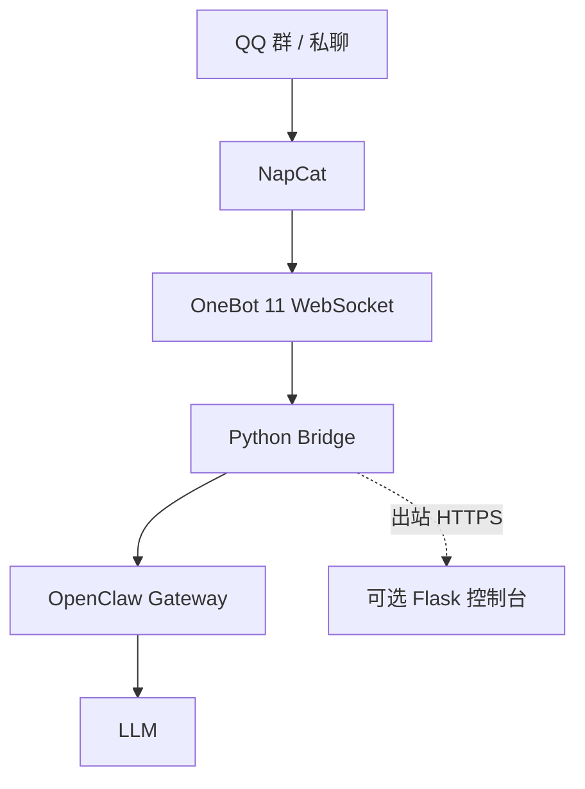

# QQ OpenClaw Bot + 可选 Web 控制台

一个把 QQ、NapCat OneBot 11、OpenClaw 与 OpenAI-compatible 模型连接起来的 Python 项目。它既可以只运行机器人核心，也可以接入现有 Flask 管理后台，在网页里查看状态、管理记忆与回复策略、切换模型密钥，并使用跨设备粘贴板。

> 项目名、网站名、机器人名、人物设定、域名、QQ 账号、模型与群黑名单都不是固定值。仓库中的名称仅是示例，实际部署全部通过环境变量配置。

## 功能一览

### 机器人核心

- QQ 群聊和私聊收发
- @、关键词、任务模式触发
- OpenClaw 文本模型链路
- 可选独立视觉模型与图片上下文
- 群消息短期缓存、长期摘要记忆与上下文管理
- 自动巡群、安静时段、每日巡群预算
- 短回复拆分：一到两句一条，可连续发送多条，更接近真实聊天
- 本地零 Token 彩蛋、互动模式、成就和活跃统计
- 有界并发、消息去重、断线重连、队列保护
- 群黑名单：不回复、不缓存、不巡群、不写记忆、不统计、不上传群号

### 可选 Web 控制台

- 心跳、NapCat、Bridge、OpenClaw 和主机资源监控
- 群与好友概览、模型调用和最近事件
- 群长期记忆查看、编辑、清空与重建
- 回复长度、消息条数、延迟、巡群和记忆参数管理
- 视觉模型与 OpenClaw API Key 的测试、替换和回滚
- 互动实验室：健康分、状态、排行榜、成就、彩蛋和模式
- 私有跨设备粘贴板：过期清理和编辑冲突保护
- 保留原 Flask 管理员会话，可增量接入现有后台

## 架构


```mermaid
flowchart TD
  QQ[QQ 群 / 私聊] --> NC[NapCat]
  NC --> OB[OneBot 11 WebSocket]
  OB --> BR[Python Bridge]
  BR --> OC[OpenClaw Gateway]
  OC --> LM[LLM]
  BR -. 出站 HTTPS .-> WEB[可选 Flask 控制台]
```

控制台不是机器人运行的前置条件。机器人主链路在控制台离线时仍可工作；所有控制请求由机器人主动拉取，网站无需 SSH 到机器人主机。

## 快速开始

环境：Linux、Python 3.11+、已运行的 NapCat OneBot WebSocket 与 OpenClaw Gateway。

```bash
git clone https://github.com/CeylanCLC/agent-qq-sandbox-bot.git
cd agent-qq-sandbox-bot

python3 deploy/install.py bot --target /opt/qq-openclaw-bot --venv
sudo cp examples/bot.env.example /etc/qq-openclaw-bot.env
sudo chmod 600 /etc/qq-openclaw-bot.env
sudoedit /etc/qq-openclaw-bot.env
```

先前台验证：

```bash
set -a
. /etc/qq-openclaw-bot.env
set +a
/opt/qq-openclaw-bot/venv/bin/python /opt/qq-openclaw-bot/qq_openclaw_bridge.py
```

确认收发正常后，再按 [快速上手](QUICKSTART.md) 安装 systemd。已有部署请先读 [迁移指南](docs/MIGRATION.md)，不要直接覆盖生产文件。

## 最重要的配置

| 变量 | 作用 | 示例 |
|---|---|---|
| `BOT_DISPLAY_NAME` | 网页和聊天中的机器人名 | `QQ AI 助手` |
| `BOT_PERSONA_NAME` | 人物名称，可与显示名相同 | `小助手` |
| `BOT_PERSONA` | 人物设定 | 简短自然的系统设定 |
| `BOT_TRIGGER_WORDS` | 逗号分隔触发词 | `小助手,助手` |
| `BLOCKED_GROUP_IDS` | 逗号分隔群黑名单 | 留空或填自己的群号 |
| `ONEBOT_WS` | 本机 OneBot WebSocket | `ws://127.0.0.1:3001` |
| `OPENCLAW_URL` | 本机 OpenClaw 接口 | `http://127.0.0.1:29306/v1/chat/completions` |
| `BOT_CONTROL_BASE_URL` | 可选控制台 HTTPS 根地址 | `https://bot.example.com` |

完整列表见 [配置参考](docs/CONFIGURATION.md)。

## 隐私与安全设计

- `BLOCKED_GROUP_IDS` 只存在于机器人主机环境文件中。
- 黑名单群在事件入口即丢弃；持久化前还会再次清理。
- 心跳和详细遥测只上传运行元数据，不上传聊天正文。
- 黑名单具体 ID 不进入状态文件、遥测、控制台或导出文件。
- API Key 不以明文返回浏览器；替换前测试，写入时使用原子更新并保留有限回滚。
- 控制面接口需要独立随机令牌；环境文件建议权限 `0600`。

详见 [安全说明](SECURITY.md)。

## 文档

- [快速上手](QUICKSTART.md)
- [给 AI 的部署指南](AI_DEPLOY.md)
- [完整配置参考](docs/CONFIGURATION.md)
- [架构与数据流](docs/ARCHITECTURE.md)
- [日常运维](docs/OPERATIONS.md)
- [故障排查](docs/TROUBLESHOOTING.md)
- [从旧版迁移](docs/MIGRATION.md)
- [更新日志](CHANGELOG.md)

## 测试

```bash
python3 -m unittest discover -s tests -v
```

测试包含语法检查、私有部署标识扫描、品牌自定义、端点强制配置和群黑名单隐私断言。

## 兼容性说明

仓库保留根目录 `qq_openclaw_bridge.py` 作为旧部署入口，它会启动 `bot/qq_openclaw_bridge.py`。`CEYLAN_*` 前缀为历史兼容变量名，不代表网站必须使用任何特定品牌。

## 免责声明

请遵守 QQ、NapCat、模型服务商和所在地区的服务条款与法律。不要把密钥、登录态、数据库、聊天记录或真实群号提交到公开仓库。
