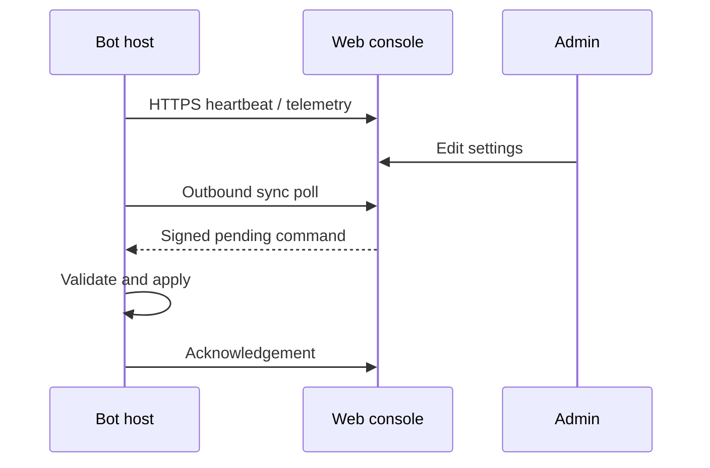

# 架构与数据流

## 运行平面

NapCat 通过 OneBot 11 WebSocket 把事件交给 Bridge。Bridge 在入口完成去重、发送者忽略和群黑名单判断，再决定写入上下文、调用视觉模型或 OpenClaw、以及回复 QQ。

群长期记忆只保存压缩摘要；短期缓存和巡群状态分别落盘。黑名单过滤在入口、装饰器、状态读写和遥测四处重复执行，避免单点遗漏。

## 控制平面

网站不主动访问机器人主机，适合两台不同云服务器。基础心跳与详细遥测独立，详细监控失败不会中断聊天。

## 目录

- `bot/`：机器人、心跳、遥测、控制同步、密钥管理与互动功能。
- `website/`：可选 Flask 参考应用及增量模块。
- `deploy/`：备份优先安装器。
- `examples/`：不含秘密的配置模板。
- `tests/`：发布隐私与配置行为测试。
